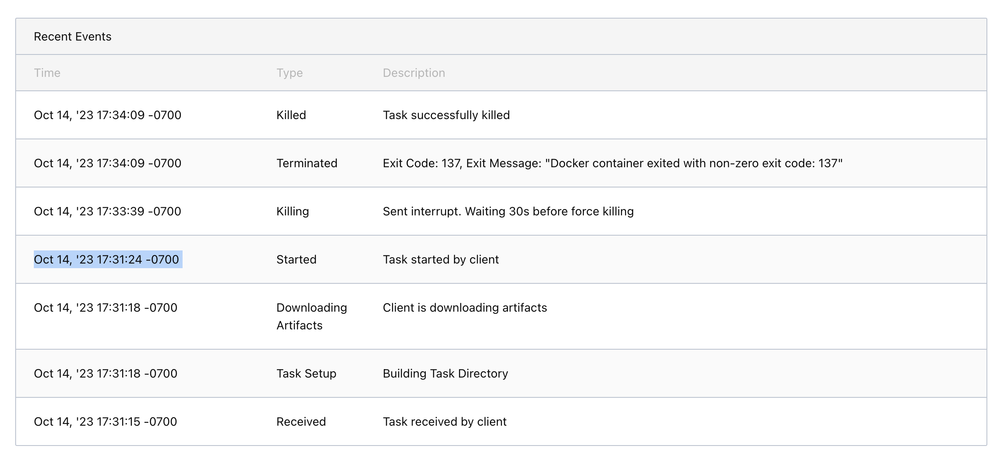
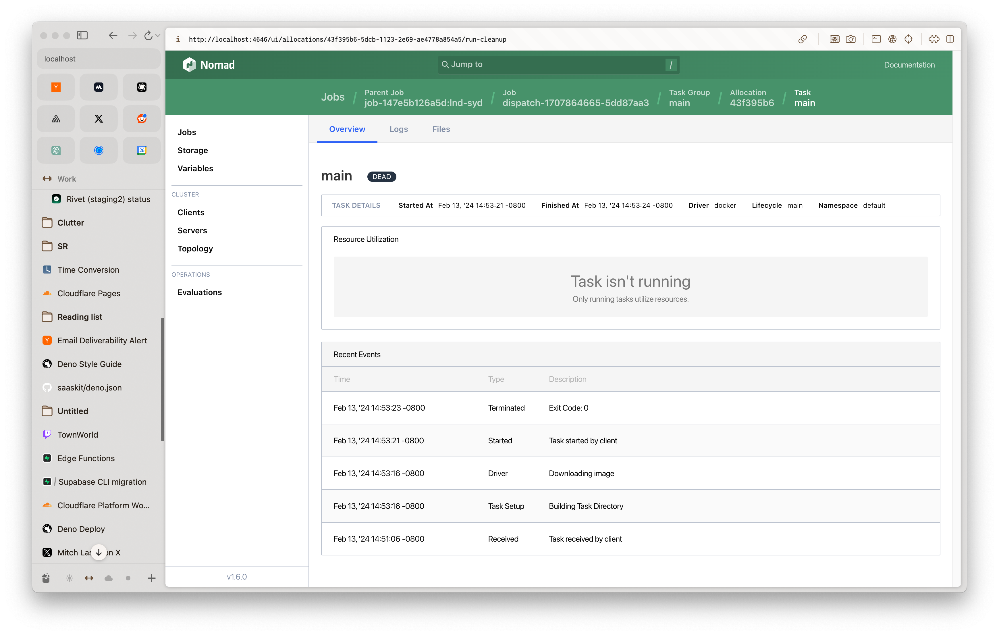
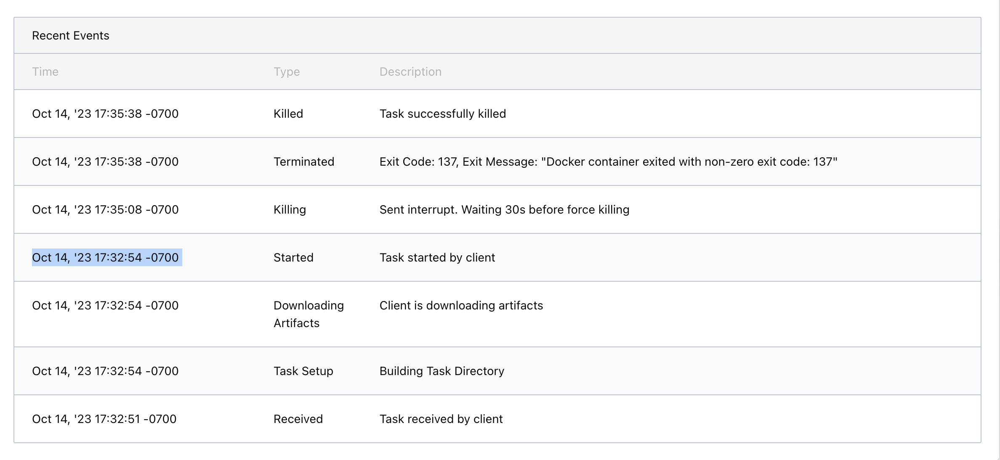

import image from '../monthly-update-01-jun-2023/opengraph-image.png';

export const config = {
  author: 'nathan-flurry',
  date: '2024-02-15',
  // TODO: More spicy titleE?
  title: 'Replacing Docker with runc cut our coldstarts by TODO%',
  // TODO:
  description: ``,
  category: 'technical',
  // TODO:
  keywords: [],
  // TODO:
  images: {
    hero: {
      image,
      alt: 'hero'
    }
  }
};

<ArticleHeader {...info} />

https://github.com/rivet-gg/rivet/blob/86cdfd4bae79ff64caed493641a3b6f99d5776fe/svc/pkg/mm/worker/src/workers/lobby_create/nomad_job.rs

https://rivet-gg.slack.com/archives/C04E356KEP8/p1697330155920889

TODO: Inspiration:

- Bear thing
- Cloudflare
- Fly.io

TODO: Link to Depot

**Rivet is a hassle-free solution to deploy & scale multiplayer game servers.
Current solutions take ~30 seconds to start a game server, this is our journey
to get that number down to 2 seconds.**

If you don't want to worry about any of this, head over to our
[getting started guide](https://rivet.gg/learn) to get your game runnign on
Rivet in 15 minutes.

This is a 3 part series on how we cut our container coldstart times by TODO%.

TODO: Show numbers at the top, this is what we want to get it down to (AWS
GameLift vs Agones vs Rivet old vs Rivet new)

Our goal is to make starting a Docker container as fast as downloading &
starting a vanilla Linux binary. We set out to find all the bloat in between
starting the download and starting the container that's slowing us down.

## Why are container start times so important to us?

TODO

## What's the problem?

When running a Docker container, it takes ~9 seconds to start a container. We'll
look at the _Downloading Artifacts_

TODO: It's more than 9 seconds



## Our old Docker-based container architecture

### Uploading builds

Docker images are built & uploaded when developers run `rivet deploy` in their
project. Instead of using a Docker Registry to store & serve Docker images, we
store a Docker tar archive built by
[`docker image save`](https://docs.docker.com/engine/reference/commandline/image_save/)
and upload that to S3. This tar will be able to be downloaded and loaded with
[`docker image load`](https://docs.docker.com/engine/reference/commandline/image_load/)
later.

<Info>
    Rivet doesn't use a [Docker registry](https://docs.docker.com/registry/) to serve Docker images in order to maintain a simple architecture with less points of failure. Game servers don't benefit from layers in the same way traditional Docker images do.

    A Docker Registry is a server dedicated to hosting Docker images. Docker Hub is the official Docker resistry, but you can host your own.

</Info>

### Nomad job

Under the hood, Rivet runs on top of [Nomad](https://www.nomadproject.io/) to
run developers' game servers as containers on our servers. This is called an
"orchestrator." Kubernetes is also an example of an orchestrator.

We use
[parameterized jobs](https://developer.hashicorp.com/nomad/docs/job-specification/parameterized)
to schedule our jobs. The relevant parts of our Nomad job looked like something
this:

```
job "job-xxxxxxxxx:xxx" {
  type = "batch"
  parameterized {
    payload = "forbidden"
    meta_required = [
      "image_artifact_url",  # This will hold the URL to download the Docker image archive from
      # ...etc...
    ]
  }
  group "main" {
    task "main" {
      driver = "docker"
      config {
        load = "image.tar"  # Load the Docker image artifact we downloaded
        image = "rivet-game:xxxxxxxxx"  # Unique tag for the image inside the tar
      }

      # Artifacts are used to download files required to run a job. In this case, we're downloading the Docker image.
      artifact {
        source = "${NOMAD_META_IMAGE_ARTIFACT_URL}"  # Reads the `image_artifact_url` metadata
        options {
          archive = "false"
        }
        destination = "local/image.tar"
      }

      # ...etc...
    }

    # ...etc...
  }
}
```

Under the hood, this is done by dynamically serializing JSON and making a
request to
[`POST /v1/job`](https://developer.hashicorp.com/nomad/api-docs/jobs#create-job).
You can find the source code for our old Nomad job
[here](https://github.com/rivet-gg/rivet/blob/86cdfd4bae79ff64caed493641a3b6f99d5776fe/svc/pkg/mm/worker/src/workers/lobby_create/nomad_job.rs#L226).

### Dispatching the job

Once we submit our parameterized job to Nomad, we need to dispatch the job to
run it on a server.

First, we need to create a
[presigned S3 request](https://docs.aws.amazon.com/AmazonS3/latest/userguide/using-presigned-url.html)
to the Docker image archive we created with `rivet deploy`. Presigned requests
create a temporary URL that allows anyone with the URL to perform a specific
action. In this case, we create a URL that allows Nomad to download the tar from
S3. This URL will expire, so if there is a security breach, our S3 credentials
are not breached.

Once we have the url, we can dispatch the job using
[`POST /v1/job/:job-id/dispatch`](https://developer.hashicorp.com/nomad/api-docs/jobs#dispatch-job)
with the following metadata:

```javascript
{
    "image_artifact_url": "https://prod-bucket-build.s3.amazonaws.com/00000000-0000-0000-0000-000000000000/build.tar?X-Amz-Algorithm=xxxxx&X-Amz-Credential=xxxxx&X-Amz-Date=xxxxx&X-Amz-Expires=xxxxx&X-Amz-SignedHeaders=xxxx&X-Amz-Signature=xxxxx",
    // ...etc...
}
```

### It works! Now let's rewrite _everything_.

Once complete, we'll be able to see an allocation's task that looks like this:



Now that we understand how the system _used_ to work, let's rewrite everything
from scratch to be blazing fast.

## Digging for the bottleneck

### Testing environment

**Hardware**

These tests were performed on a Linode instance on the _Dedicated 4 GB_ plan.
These instances have an advertised 40 Gbps up & 4 Gbps down network speed under
perfect conditions.

<Info>
  1 Gbps is equal to 125 MB/s
</Info>

**Testing image**

These tests were ran using a 108 MB Docker image archive.

**Where the image is being downloaded from**

The image is being downloaded from an instance of [Apache Traffic
Server](https://trafficserver.apache.org/) (no, not [Apache
Server](https://httpd.apache.org/) you're thinking of) inside the same VLAN as
the machine we're testing on.

Apache Traffic Server (ATS) is a high-performance server written in C++, this
post assumes there is no significant overhead in ATS serving the file.

VLAN network speed reliability are a subject for a different blog post, but they
are reliable enough to assume they are not the bottleneck.

**Theoretical limit**

Assuming no CPU or I/O overhead, the theoretical limit for downloading the image
is 210 milliseconds (`108 MB / (125 MB/s * 4 Gbps) = 0.21 milliseconds`). It's
unlikly we'll reach that number in practice.

### The problem

The bottleneck was immediately obvoius by seeing the _Downloading Artifacts_ step
takes almost all of the startup time. We're going to ignore the other steps for
now, as they're negligible in comparison.

The main bottlenecks to starting a Docker container are likely going to be
related to:

1. Network speeds
2. Disk I/O
3. Unknown CPU overhead

### Jumping to conclusions: it's not the network speed

My first mistake was assuming _Downloading Artifacts_ indicated only the time it
take for Nomad to download the `image.tar`. Downloading the image should not
take ~6 seconds.

After chasing my tail for a while diagnosing network speeds and finding no
issues, I noticed that the _Downloading Artifacts_ step would sometimes take
less than 1 second.

| What I usually see | What I sometimes see |
| --- | --- |
|  |  |

_What?_ How does this happen? If this was a network speed or I/O issue, this
should never happn.

This is when I noticed that the Nomad task events jump straight from _Downloading
Artifacts_ to _Started_. Where does the `image.tar` actually get loaded to the
Docker daemon (i.e. by running `docker load`)?

### Digging through the Nomad source code: what is actually happning during _Downloading Artifacts_?

If we were to reproduce what Nomad is doing under the hood in a shell script, it
should look something like this:

```sh
# Nomad's "Downloading Artifacts" step
curl 'http://url/to/image.tar' > image.tar
# When does Nomad run step?!
cat image.tar | docker load -
# Nomad's "Started" step
docker start my-image-tag
```

It was time to get our hands dirty with the Nomad source code. With a bit of
digging, I tracked down the relevant code. This is the lifecycle of a Nomad job
that we're seeing:

1. [`Prestart` in artifact_hook.go](https://github.com/hashicorp/nomad/blob/e8db58836843244b579b0ecdf8cc3bbcb3ce90eb/client/allocrunner/taskrunner/artifact_hook.go#L86)
  starts downloading the `image.tar`
2. [`EmitEvent(NewTaskEvent(TaskDownloadingArtifacts))` in artifact_hook.go](https://github.com/hashicorp/nomad/blob/e8db58836843244b579b0ecdf8cc3bbcb3ce90eb/client/allocrunner/taskrunner/artifact_hook.go#L86)
    - This is our _Downloading Artifacts_ step
3. [`driver.StartTask` in task_runner.go](https://github.com/hashicorp/nomad/blob/e8db58836843244b579b0ecdf8cc3bbcb3ce90eb/client/allocrunner/taskrunner/task_runner.go#L918C1-L919C1),
   which calls the Docker driver's [`StartTask`
   implementation in docker/driver.go](https://github.com/hashicorp/nomad/blob/e8db58836843244b579b0ecdf8cc3bbcb3ce90eb/drivers/docker/driver.go#L300)
   - Notice that no event has been emitted, the most recent event is still _Downloading Artifacts_
4. [`createImage` in
   docker/driver.go](https://github.com/hashicorp/nomad/blob/e8db58836843244b579b0ecdf8cc3bbcb3ce90eb/drivers/docker/driver.go#L332C15-L332C26)
   handles finding and downloading the Docker image
5. [`loadImage` in
   docker/driver.go](https://github.com/hashicorp/nomad/blob/e8db58836843244b579b0ecdf8cc3bbcb3ce90eb/drivers/docker/driver.go#L603)
   - Bingo! This is where our `image.tar` is being loaded in to the Docker
     daemon.
   - However, no event is emitted here either! The most recent event is still
     _Downloading Artifacts_.
6. [`EmitEvent(NewTaskEvent(TaskStarted))` in
   task_runner.go](https://github.com/hashicorp/nomad/blob/e8db58836843244b579b0ecdf8cc3bbcb3ce90eb/client/allocrunner/taskrunner/task_runner.go#L958)
   - This gets ran after the `StartTask` function returns, which is after
     `loadImage` has finished.
   - This finally emits the _Started_ event

In short: the _Downloading Artifacts_ step is actually the time it takes to
both:

1. Download the `image.tar` from the URL
2. Load the `image.tar` in to the Docker daemon

### The bottleneck: `docker load`

At this point, it was clear that the bottleneck was not in downloading the
`image.tar` file itself, but actually loading the image in to the daemon.

Testing that theory was pretty simple: I loaded a copy of the `image.tar` on the
testing machine and ran the following command:

```sh
# Prune the Docker file system to ensure the file isn't already loaded in to the Daemon
$ docker system prune -fa

# Load the image.tar in to the Docker daemon
$ time docker load -i /tmp/image.tar
d987e4280acd: Loading layer [==================================================>]  2.048kB/2.048kB
0a805269e986: Loading layer [==================================================>]  13.98MB/13.98MB
f0036a524cbf: Loading layer [==================================================>]  115.2kB/115.2kB
418b13fede00: Loading layer [==================================================>]  255.1MB/255.1MB
b75660849347: Loading layer [==================================================>]  130.6kB/130.6kB
2d46ed697930: Loading layer [==================================================>]  3.584kB/3.584kB
0348c7bebf92: Loading layer [==================================================>]  16.38kB/16.38kB
f0b68aef9866: Loading layer [==================================================>]  12.29kB/12.29kB
Loaded image: game:latest

real    0m5.117s
user    0m0.066s
sys     0m0.224s

# Load the same image again to see if it's cached
root@localhost:~/rivet/examples/javascript/sandbox# time docker load -i /tmp/image.tar
Loaded image: game:latest

real    0m0.812s
user    0m0.046s
sys     0m0.368s
```

That explains why the _Downloading Artifacts_ step sometimes takes less than 1
second: on the first run, Docker is loading the image in to the daemon. On the
second run, Docker knows the image is already loaded and doesn't need to load it
at all.

### Digging through Docker's source code: what is actually happening during `docker load`?

This is when I realized I don't really understand what's happening when I run
`docker load`. So I cloned Docker's source code and started adding logging to
all of the relevant steps in the `docker load` process.

Docker itself is actually a wrapper around a Go library called
[`containerd`](https://containerd.io/), and the `docker load` roughly equivalent
to the `containerd` command `ctr images import`. 

TODO: Face reveal meme

It became clear that most of the load time was being spent in contianerd's


TODO: Find links for source
{/* [`Unpack`](https://github.com/containerd/containerd/blob/23573965ffcf8bdb282389b5705de5e3082be824/cmd/ctr/commands/images/import.go#L276C5-L277C1)
function.
- [`LayerConvertFunc`](https://github.com/containerd/containerd/blob/00fe7a497446d82c4fa9c3263acf4a9cced88f60/core/images/converter/uncompress/uncompress.go#L37C6-L37C22)
- [`DecompressStream`](https://github.com/containerd/containerd/blob/00fe7a497446d82c4fa9c3263acf4a9cced88f60/pkg/archive/compression/compression.go#L185) */}

When testing loading images on different machines, I found that the machine
would pin one CPU core at 100% for the entire duration of the `docker load`.
This indicates that the bottleneck is likely CPU-bound.

All in all: Docker's dependence on Gzip for image compression is the largest
bottleneck to starting a container.

## Investigating solutions

### Fork Docker

### Go a layer deeper: remove containerd & Docker

TODO: Overview of Docker & containerd architecture

<Info>
  TODO: The missed solution: containerd supports zstd compressinonatively
</Info>

## A primer on OCI bundles

### Bundles vs images

### OCI bundle structure

### Read more

TODO: Networking, etc

## Comparing compression formats

TODO: Needs to have low CPU overhead
TODO: Bottlenecked by VLAN

## Implementing OCI bundles

TODO: Overview of new build process

### Building the bundle

TODO: Portability constraint

TODO: Exporting image from Docker

TODO: Reading the user

TODO: Assembling the config.json

### Compressing the bundle


### Downloading & configuring the OCI bundle

### Networking with CNI & iptables

### Our new driver & why Nomad is goated

TODO: Link to Fermyon

### Backwards compatability with Docker tars

---


| Method | Time     | Command                                                                                                                                                                                                        |
| ------ | -------- | -------------------------------------------------------------------------------------------------------------------------------------------------------------------------------------------------------------- |
| Pipe   | 0m6.242s | `time sh -c "curl 'http://10.0.0.65:8080/s3-cache/aws/test24-bucket-build/1b578337-afdd-4b09-88da-6fad732b5448/image.tar' \| docker load`                                                                      |
| File   | 0m6.190s | `curl 'http://10.0.0.65:8080/s3-cache/aws/test24-bucket-build/1b578337-afdd-4b09-88da-6fad732b5448/image.tar' > my_image.tar && time docker load -i my_image.tar`                                              |
| Untar  | 0m0.064s | `curl 'http://10.0.0.65:8080/s3-cache/aws/test24-bucket-build/1b578337-afdd-4b09-88da-6fad732b5448/image.tar' > my_image.tar && rm -rf image-out && mkdir image-out && time tar -xf my_image.tar -C image-out` |


## Alternatives considered

- Split up things
  - Nydus
  - Starsomething
- Run an on-prem pull-through Docker regsitry
- Pre-unpack images to not have to decompress (not-possible)
- Add a new compression format
  https://github.com/containerd/containerd/blob/00fe7a497446d82c4fa9c3263acf4a9cced88f60/pkg/archive/compression/compression.go#L185
- Switch to lz4 compression
- containerd zstd support
  - https://github.com/containerd/containerd/blob/00fe7a497446d82c4fa9c3263acf4a9cced88f60/pkg/archive/compression/compression.go#L220

## Edge caching architecture & CNI/iptables dynamic configuration

In later posts, we'll discuss our caching architecture and how we dynamically
configure CNI & iptables for our game servers. Join our
[Discord](https://rivet.gg/discord) or follow us on [X](https://x.com/rivet_gg)
for more.
